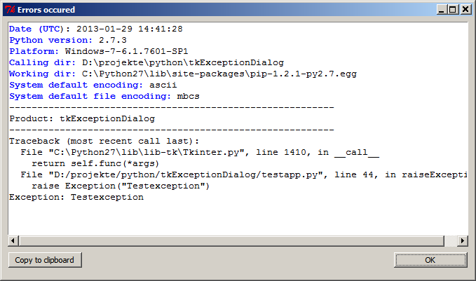

tkExceptionDialog
=================

Exception handling dialog written in `Python`_  for `Tkinter`_.

Sample
------

The default dialog will show some more information about the system:

License
-------

The tkExceptionDialog is released under the `MIT License`_.

.. _python: http://www.python.org
.. _Tkinter: http://docs.python.org/2/library/tkinter.html
.. _MIT License: http://www.opensource.org/licenses/MIT

